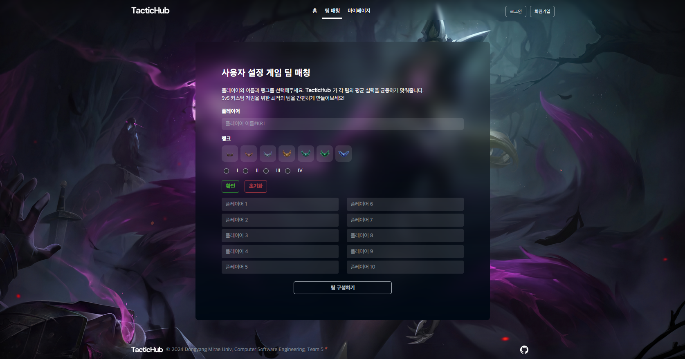
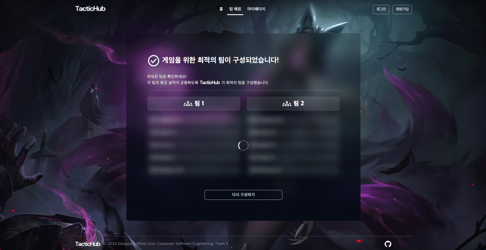
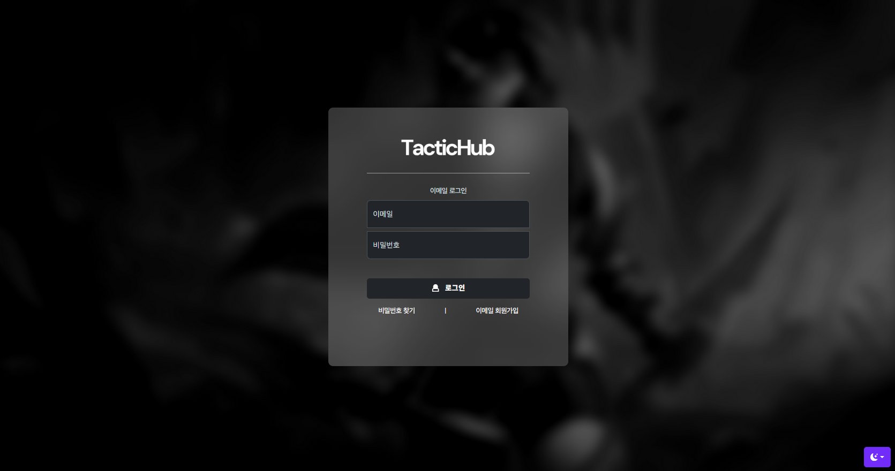

# TacticHub Web Page v1.0.0

> 동양미래대학교 컴퓨터소프트웨어공학과 기말고사 프로젝트  
> 개발기간: 2학기 중(2024.11 ~ 2025.1)

## 팀

[@jyaniee](https://github.com/jyaniee) | 메인 프론트엔드  
[@dulgix](https://github.com/dulgix) | 서브 프론트엔드, 서브 백엔드  
[@hogyeom3527](https://github.com/hogyeom3527) | 메인 백엔드

## 프로젝트 소개

**TacticHub는 5v5 커스텀 게임을 위한 팀 매칭 플랫폼입니다.**

사용자가 입력한 플레이어 정보(이름, 랭크, 티어)를 기반으로, 각 팀의 평균 실력이 균등하도록 최적의 팀을 구성합니다.  
웹 기반으로 제작되어 직관적이고 깔끔한 UI를 제공합니다.

## 화면 구성

| 메인 페이지                                           | 팀 구성 페이지                                                |
| :-------------------------------------------: | :------------: |
|      |    |
| 결과 페이지                                           | 로그인 폼                                                   |
|    |            |

---

## 주요 기능

- **플레이어 정보 입력**: 이름과 랭크, 티어 정보를 간편하게 입력.
- **팀 매칭 결과 제공**: 최적의 팀 구성 결과를 시각적으로 출력.
- **라이엇 API 연동**: Riot API를 연동하여 정보 입력 자동화.
- **팀 구성 결과 기록(History) 제공**: 팀 구성 결과를 기록하여 추후에 열람 가능.(회원만)

---

## Stacks

### Environment

 

### Development

### Communication

